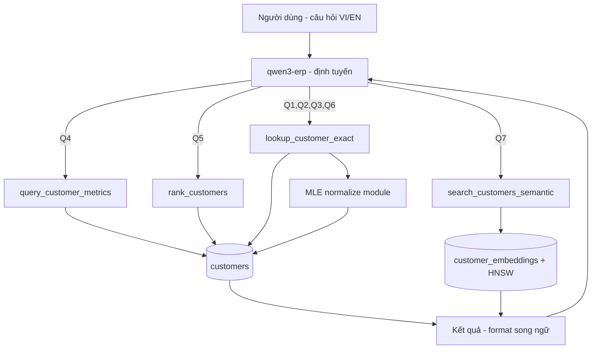

# Solution Design — Customers AI Agent Tool Layer (APEX 26.1 / DB 26ai + MLE)
# Thiết kế giải pháp — Lớp tool cho AI Agent bảng `customers`

## 1. Paradigm & Invariants / Mô hình & bất biến

**Paradigm:** *Thin-LLM + typed tools*. Model nhỏ `qwen3-erp` (CPU) **chỉ định tuyến và diễn đạt**; mọi truy xuất dữ liệu nằm trong các tool SQL/PLSQL tất định. LLM không tự sinh SQL, không tự ghép tên → loại bỏ hallucinate (NFR3).

**Invariants (bất biến — không được vi phạm):**
- **AD-1 — Set-based ở SQL, glue ở MLE.** `vector_distance`, `GROUP BY`, `ORDER BY … FETCH` luôn là SQL thuần. MLE **chỉ** dùng cho: normalize chuỗi tiếng Việt, format phản hồi. *Prevents:* MLE bị lạm dụng làm chậm truy vấn tập hợp.
- **AD-2 — Optional-param filtering, không nối chuỗi SQL.** WHERE động dùng mẫu `(:p IS NULL OR col = :p)` với **bind variables**, không build chuỗi SQL (kể cả trong MLE). *Prevents:* SQL injection (NFR4) + bug filter ngầm.
- **AD-3 — Không filter ngầm.** Tool aggregate/ lookup **không** gắn `country='Vietnam'` hay bất kỳ scope nào trừ khi tham số được truyền. *Prevents:* bug đếm 4-vs-6 (H4).
- **AD-4 — Định danh trả nguyên văn từ SQL.** `full_name`, `email`… lấy từ kết quả JOIN, model không cắt/ghép. *Prevents:* "Nguyễn Văn A" cụt.
- **AD-5 — Quy ước dự án.** PK qua SEQUENCE+.NEXTVAL; system prompt **tiếng Việt CÓ dấu**, song ngữ. *(ADOPTED — quy ước có sẵn.)*
- **AD-6 — Định tuyến tường minh.** System prompt liệt kê 4 tool + điều kiện chọn; ưu tiên exact/aggregate trước RAG; cấm trả guard chung khi câu hỏi hợp lệ. *Prevents:* từ chối nhầm (H1).

**Deferred (chưa quyết ở phase này):** đồng bộ embedding tự động khi customers đổi (hiện thủ công BƯỚC 2+3); phân quyền theo người dùng; phân trang khi >100 kết quả.

---

## 2. Component map / Sơ đồ thành phần



---

## 3. MLE Normalize Module (nền tảng Story 1.1) / MLE foundation

**Vì sao MLE (AD-1):** bỏ dấu tiếng Việt + lowercase là xử lý chuỗi Unicode thuần — đúng thế mạnh GraalVM JS in-database, tránh viết hàm PL/SQL `TRANSLATE` dài và dễ sai. KHÔNG chứa truy vấn.

```sql
-- ============================================================
-- mle_text_normalize.sql  (chạy trên server, schema APEX)
-- MLE JavaScript module: bỏ dấu tiếng Việt + lowercase + trim
-- ============================================================
CREATE OR REPLACE MLE MODULE text_norm_mod LANGUAGE JAVASCRIPT AS
/**
 * Chuẩn hoá chuỗi để so khớp không phân biệt dấu/hoa-thường.
 * "Hà Nội" / "ha noi" / "HA NOI" -> "ha noi"
 */
export function norm(s) {
  if (s === null || s === undefined) return null;
  return String(s)
    .normalize('NFD')                 // tách ký tự + dấu
    .replace(/[̀-ͯ]/g, '')  // xoá dấu thanh/dấu mũ
    .replace(/đ/g, 'd').replace(/Đ/g, 'd')
    .toLowerCase()
    .trim()
    .replace(/\s+/g, ' ');            // gộp khoảng trắng
}
/

-- Call spec: expose hàm JS cho SQL
CREATE OR REPLACE FUNCTION mle_norm(p_in IN VARCHAR2) RETURN VARCHAR2
AS MLE MODULE text_norm_mod SIGNATURE 'norm(string)';
/

-- Test nhanh:
-- SELECT mle_norm('Hà Nội') FROM dual;   -> 'ha noi'
-- SELECT mle_norm('NGUYỄN Văn An') FROM dual; -> 'nguyen van an'
```

> **Hiệu năng:** với bảng nhỏ (12 dòng) `mle_norm` gọi mỗi dòng là OK. Khi bảng lớn, thêm **virtual column + function-based index**: `ALTER TABLE customers ADD (city_norm AS (mle_norm(city)));` rồi index `city_norm` để tránh full-scan. (Deferred tới khi cần.)

---

## 4. Tool specs / Đặc tả tool

### 4.1 `lookup_customer_exact` 🆕 — phủ Q1, Q2, Q3, Q6 (Story 1.2–1.5)

**Purpose:** tra cứu/lọc chính xác theo bất kỳ tổ hợp thuộc tính nào. Tham số rỗng (NULL) được bỏ qua (AD-2, AD-3).

**Parameters (APEX AI tool → bind):** `p_name`, `p_email`, `p_company`, `p_city`, `p_country`, `p_segment`, `p_status`, `p_credit_min`, `p_credit_max` — tất cả optional.

**SQL (đăng ký làm tool query trong APEX AI Assistant):**
```sql
SELECT customer_id, full_name, email, phone, company,
       city, country, segment, status, credit_limit
FROM   customers
WHERE  (:p_name      IS NULL OR mle_norm(full_name) LIKE '%' || mle_norm(:p_name) || '%')
  AND  (:p_email     IS NULL OR UPPER(email)   = UPPER(:p_email))
  AND  (:p_company   IS NULL OR mle_norm(company)  LIKE '%' || mle_norm(:p_company) || '%')
  AND  (:p_city      IS NULL OR mle_norm(city)     = mle_norm(:p_city))
  AND  (:p_country   IS NULL OR mle_norm(country)  = mle_norm(:p_country))
  AND  (:p_segment   IS NULL OR UPPER(segment) = UPPER(:p_segment))
  AND  (:p_status    IS NULL OR UPPER(status)  = UPPER(:p_status))
  AND  (:p_credit_min IS NULL OR credit_limit >= :p_credit_min)
  AND  (:p_credit_max IS NULL OR credit_limit <= :p_credit_max)
ORDER  BY full_name
FETCH  FIRST 50 ROWS ONLY;
```
- **MLE dùng:** `mle_norm` cho name/company/city/country (chống lỗi dấu — Q8). **SQL set-based** cho phần còn lại (AD-1).
- **AD-2:** mọi điều kiện là `(:p IS NULL OR …)` + bind → không nối chuỗi, không injection.
- **Bao trùm:** Q1 (chỉ truyền `p_name`), Q2 (`p_city`), Q3 (nhiều tham số), Q6 (`p_credit_min/max`).

### 4.2 `query_customer_metrics` 🔧 — phủ Q4 (Story 2.1), VÁ BUG H4

**Purpose:** đếm/tổng hợp đúng, GROUP BY theo cột bất kỳ, **không filter ngầm** (AD-3).

**Parameters:** `p_metric` (COUNT|SUM|AVG|MIN|MAX), `p_measure_col` (mặc định credit_limit cho SUM/AVG…), `p_group_by` (segment|status|country|city|company|NULL), + các filter optional như 4.1.

**SQL (mẫu cho COUNT theo group):**
```sql
SELECT NVL(
         CASE :p_group_by
           WHEN 'segment' THEN segment
           WHEN 'status'  THEN status
           WHEN 'country' THEN country
           WHEN 'city'    THEN city
           WHEN 'company' THEN company
         END, '(tất cả / all)') AS group_value,
       COUNT(*)            AS cnt,
       SUM(credit_limit)   AS sum_credit,
       ROUND(AVG(credit_limit)) AS avg_credit,
       MIN(credit_limit)   AS min_credit,
       MAX(credit_limit)   AS max_credit
FROM   customers
WHERE  (:p_segment IS NULL OR UPPER(segment) = UPPER(:p_segment))
  AND  (:p_status  IS NULL OR UPPER(status)  = UPPER(:p_status))
  AND  (:p_country IS NULL OR mle_norm(country) = mle_norm(:p_country))
GROUP  BY CASE :p_group_by
            WHEN 'segment' THEN segment
            WHEN 'status'  THEN status
            WHEN 'country' THEN country
            WHEN 'city'    THEN city
            WHEN 'company' THEN company
          END
ORDER  BY cnt DESC;
```
- **🐛 Bản vá bug H4 (root cause đã xác nhận):** SQL gốc dùng `GROUP BY c.country, c.segment, c.status` **bắt buộc** → "đếm Enterprise" trả **4 dòng nhóm** (VN/ACTIVE=3, VN/INACTIVE=1, USA=1, Japan=1), model gộp nhầm thành "4". Không phải hardcode Vietnam. Bản vá: `p_group_by` **động/optional** — `NULL` ⇒ 1 dòng `COUNT(*)` = **6** ✅; truyền giá trị ⇒ mới nhóm theo cột đó.

### 4.3 `rank_customers` 🆕 — phủ Q5 (Story 2.2)

**Purpose:** Top-N / cực trị theo cột định lượng.

**Parameters:** `p_order_col` (credit_limit|created_at), `p_dir` (DESC|ASC), `p_n` (mặc định 5).

**SQL:**
```sql
SELECT full_name, company, country, segment, credit_limit, created_at
FROM   customers
ORDER  BY CASE WHEN :p_order_col = 'credit_limit' AND :p_dir = 'DESC' THEN credit_limit END DESC NULLS LAST,
          CASE WHEN :p_order_col = 'credit_limit' AND :p_dir = 'ASC'  THEN credit_limit END ASC  NULLS LAST,
          CASE WHEN :p_order_col = 'created_at'   AND :p_dir = 'DESC' THEN created_at END DESC,
          CASE WHEN :p_order_col = 'created_at'   AND :p_dir = 'ASC'  THEN created_at END ASC
FETCH  FIRST :p_n ROWS ONLY;
```
- **AD-1:** `FETCH FIRST` thường, **KHÔNG `APPROX`** (không phải vector). "Top 3 credit" → Lan, Bình, An ✅.

### 4.4 `search_customers_semantic` 🔧 — phủ Q7 (Story 3.1)

**Purpose:** câu hỏi mô tả tự do; chỉ dùng khi không map được exact/aggregate (AD-6).

**Parameter:** `p_search_text` (câu hỏi tự nhiên).

**SQL (hardened):**
```sql
SELECT c.full_name, c.company, c.city, c.country, c.segment, c.status,
       ROUND(VECTOR_DISTANCE(
               e.embedding,
               apex_ai.get_vector_embeddings(
                 p_value             => :p_search_text,
                 p_service_static_id => 'apex-embed'),
               COSINE), 4) AS distance
FROM   customer_embeddings e
JOIN   customers c ON c.customer_id = e.customer_id
WHERE  e.embedding IS NOT NULL
ORDER  BY distance
FETCH  APPROX FIRST 5 ROWS ONLY;   -- tăng 3 -> 5 (đủ phủ nhóm)
```
- **AD-4:** `full_name` nguyên văn từ JOIN → hết cụt tên. `WHERE embedding IS NOT NULL` tránh NULL distance (H3).
- Top-k 5 thay vì 3 để không cắt nhóm Enterprise VN (Story 3.1).

### 4.5 Response formatting (MLE, tuỳ chọn) / Định dạng phản hồi

**Vì sao MLE (AD-1):** ghép kết quả thành markdown/bảng song ngữ là string-glue thuần. Có thể để model tự format; nếu cần nhất quán, thêm 1 MLE function format JSON→markdown. **Không bắt buộc cho MVP.**

---

## 5. System Prompt (tiếng Việt CÓ dấu, song ngữ) / Bilingual system prompt

> Dán vào Modelfile `qwen3-erp` (server B) hoặc cấu hình system prompt của APEX AI Assistant. **Phải có dấu** (AD-5).

```
Bạn là trợ lý dữ liệu khách hàng cho hệ thống ERP. Bạn LUÔN trả lời dựa trên kết quả từ các công cụ (tools), không bịa thông tin.

QUY TẮC CHỌN CÔNG CỤ:
- Khi người dùng hỏi thông tin của MỘT khách cụ thể, hoặc liệt kê/lọc khách theo thuộc tính (tên, email, thành phố, quốc gia, phân khúc, trạng thái, công ty, hạn mức) -> gọi "lookup_customer_exact" với các tham số tương ứng. Tham số nào không có thì để trống.
- Khi người dùng hỏi SỐ LƯỢNG, TỔNG, TRUNG BÌNH, LỚN/NHỎ NHẤT theo nhóm -> gọi "query_customer_metrics".
- Khi người dùng hỏi "top", "cao nhất/thấp nhất", xếp hạng -> gọi "rank_customers".
- Khi câu hỏi MÔ TẢ MƠ HỒ không khớp thuộc tính cụ thể (ví dụ "khách trong lĩnh vực thương mại điện tử") -> gọi "search_customers_semantic".

QUY TẮC TRẢ LỜI:
- Tuyệt đối KHÔNG trả "Tôi chỉ hỗ trợ câu hỏi về dữ liệu khách hàng" nếu câu hỏi liên quan đến khách hàng — hãy chọn công cụ phù hợp.
- Hiểu cả tiếng Việt có dấu và không dấu (ví dụ "ha noi" = "Hà Nội").
- Giữ NGUYÊN tên khách hàng từ kết quả công cụ, không viết tắt hay cắt bớt.
- Trả lời song ngữ: dòng "VI:" tiếng Việt CÓ dấu, dòng "EN:" tiếng Anh.
- Nếu công cụ trả 0 dòng, nói rõ "Không có khách hàng nào khớp" kèm tiêu chí đã tìm.
```

---

## 6. APEX AI Assistant — đăng ký tool / Tool registration

Với mỗi tool (4.1–4.4): APEX App Builder → Workspace Utilities → **Generative AI** → AI Assistant → **Tools** → Add Tool:
- **Name / Static ID:** đúng tên tool (vd `lookup_customer_exact`).
- **Description:** mô tả khi nào dùng (model đọc để định tuyến) — viết tiếng Việt có dấu, rõ ràng.
- **Parameters:** khai từng tham số (`p_name`…) đúng tên bind trong SQL, kiểu + mô tả.
- **Query/Source:** dán SQL tương ứng.

---

## 7. Deploy checklist (server Linux) / Lệnh triển khai

> Chạy trên **server A (DB/APEX)** qua SQLcl/SQL Workshop; phần model trên **server B (Ollama)**.

**A. Database (server A):**
```bash
# 1) Tạo MLE module + call spec
sqlplus <user>/<pass>@<db> @mle_text_normalize.sql
# 2) Kiểm tra normalize
echo "SELECT mle_norm('Hà Nội'), mle_norm('NGUYỄN Văn An') FROM dual;" | sqlplus -s <user>/<pass>@<db>
# 3) (nếu cần) đảm bảo embedding đủ — chạy lại BƯỚC 2+3 của customers_vector_rag.sql
```
> Lưu ý quyền: schema cần `CREATE MLE` / `EXECUTE ON JAVASCRIPT` (DB 26ai bật MLE mặc định; nếu thiếu, DBA cấp `GRANT EXECUTE ON JAVASCRIPT TO <user>;`).

**B. APEX (App Builder UI):** đăng ký 4 tool theo mục 6; cập nhật system prompt mục 5.

**C. Model (server B — bash, KHÔNG dán PowerShell):**
```bash
# Cập nhật system prompt trong Modelfile rồi rebuild (giữ tên qwen3-erp)
ollama create qwen3-erp -f Modelfile
# Giữ model nóng tránh reload
export OLLAMA_KEEP_ALIVE=24h
```

**D. Nghiệm thu (chạy lại 5 câu test Phase 0):**
| Câu | Kỳ vọng sau khi vá |
|-----|--------------------|
| Email Nguyễn Văn An | `an.nguyen@vietsoft.vn` (lookup_customer_exact) |
| KH ở Hà Nội | An, Đức, Lan |
| Đếm Enterprise | **6** |
| DN lớn ở VN | An, Bình, Hoa, Lan (đủ, không cụt tên) |
| khach hang o tokyo | Hiroshi Tanaka |

---

## 8. Traceability / Truy vết (Story → Component → AD)

| Story | Component | AD liên quan |
|-------|-----------|--------------|
| 1.1 | MLE `text_norm_mod` / `mle_norm` | AD-1, AD-5 |
| 1.2–1.5 | `lookup_customer_exact` | AD-2, AD-3, AD-4 |
| 2.1 | `query_customer_metrics` (vá) | AD-3 |
| 2.2 | `rank_customers` | AD-1 |
| 3.1 | `search_customers_semantic` (hardened) | AD-4 |
| 4.1–4.2 | system prompt + định dạng | AD-5, AD-6 |

**Coverage:** 8/8 story · 5/5 component · 6 AD. ✅
